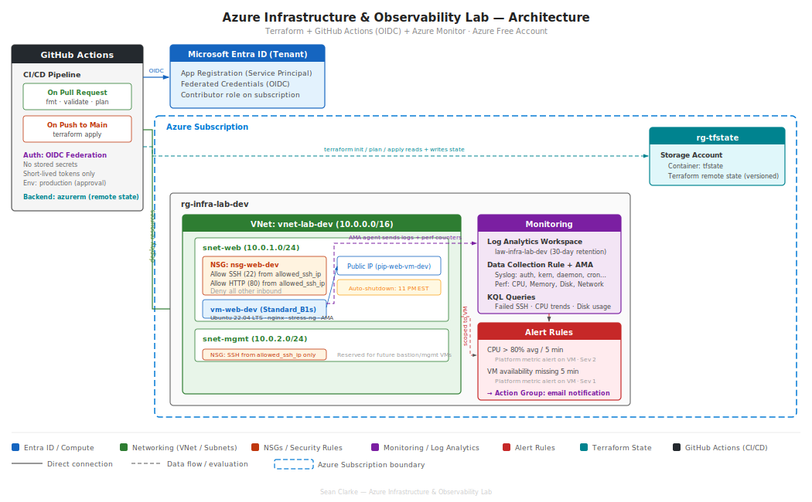

# Azure Infra + Observability Lab (Terraform + GitHub Actions OIDC)

This project provisions a small Azure environment with Terraform and demonstrates end-to-end observability and CI/CD:

- Core infrastructure: VNet, subnets, NSGs, Public IP, Ubuntu VM, nginx
- Observability: Log Analytics + Azure Monitor Agent (AMA) ingestion
- Alerting: Azure Monitor alert rules + email notifications (validated)
- CI/CD: GitHub Actions Terraform **plan** (PR) and **apply** (main) using **OIDC** (no client secrets)

---

## Architecture



---

## Repo Structure

- `infra/` — Terraform (core infra + monitoring/alerting)
- `.github/workflows/` — GitHub Actions
  - `terraform-plan.yml` — runs `terraform plan` on PRs
  - `terraform-apply.yml` — runs `terraform apply` on pushes to `main` (production environment)
- `docs/`
  - `runbook-cpu-alert-investigation.md`
  - `screenshots/` — proof images

---

## Proof (Clickable)

### Phase 3 — Monitoring + Alerting
- Heartbeat ingesting (Log Analytics):  
  `docs/screenshots/heartbeat.png`
- Alert rules enabled (Azure Monitor):  
  `docs/screenshots/alert-rules.png`
- High CPU alert fired (Azure Monitor):  
  `docs/screenshots/alert-fired-high-cpu.png`
- Alert email notification:  
  `docs/screenshots/alert-email.png`
- KQL CPU spike chart (Log Analytics):  
  `docs/screenshots/kql-cpu-spike.png`

### Phase 4 — CI/CD (GitHub Actions + OIDC)
- Terraform Apply succeeded (main):  
  `docs/screenshots/actions-apply-success.png`
- Terraform Plan succeeded (PR):  
  `docs/screenshots/actions-plan-success.png`
- PR checks passed:  
  `docs/screenshots/pr-checks-passed.png`

---

## Runbook

- CPU alert investigation: `docs/runbook-cpu-alert-investigation.md`

---

## CI/CD Notes (OIDC)

GitHub Actions authenticates to Azure using **federated credentials (OIDC)** instead of client secrets.

- PRs run `terraform plan`
- Push/merge to `main` runs `terraform apply` in the `production` environment

---

## Run Locally (Optional)

From `infra/`:

```bash
terraform init
terraform plan
terraform apply