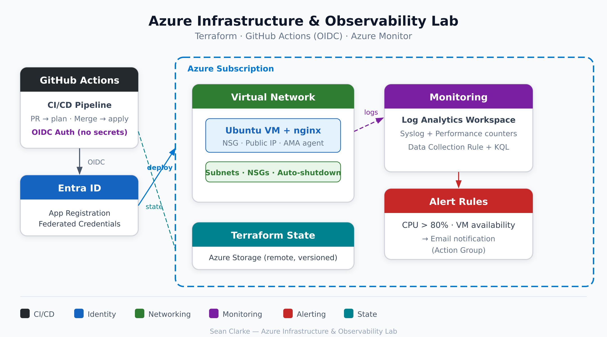
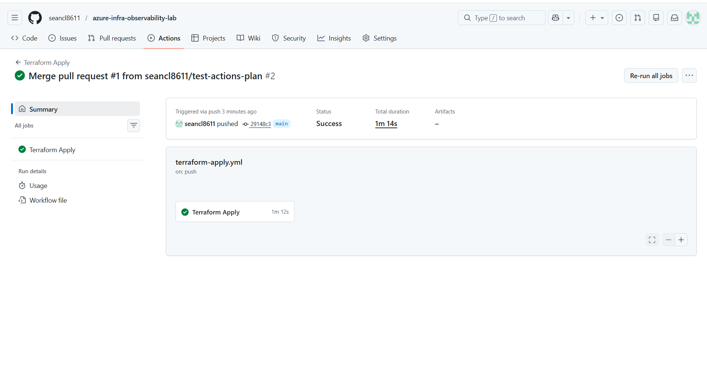
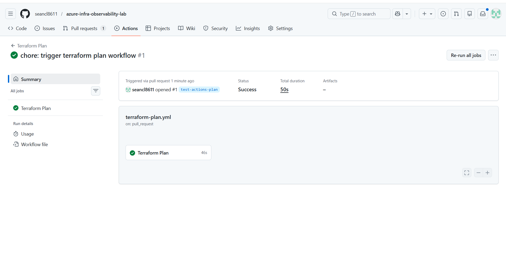
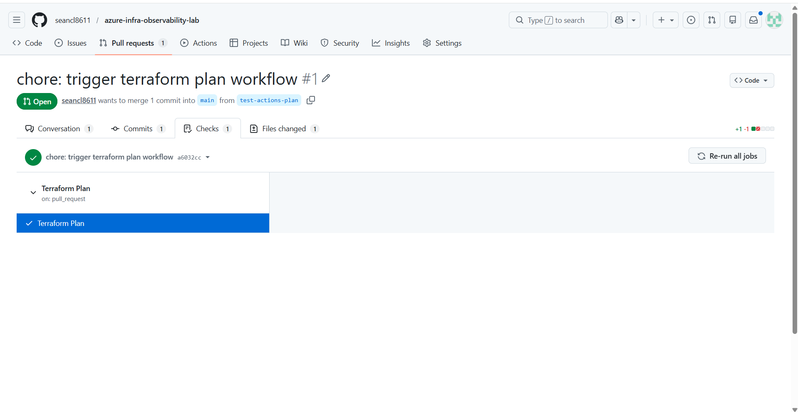
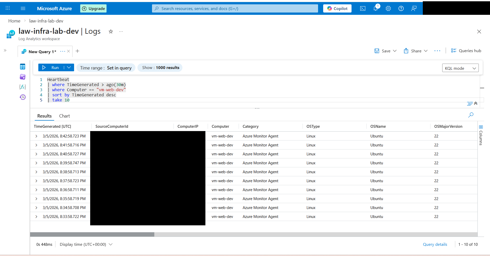
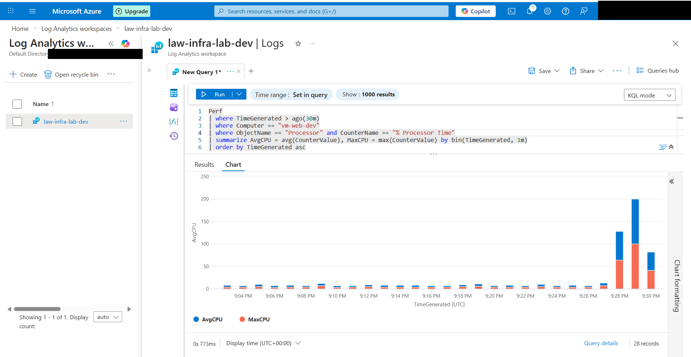
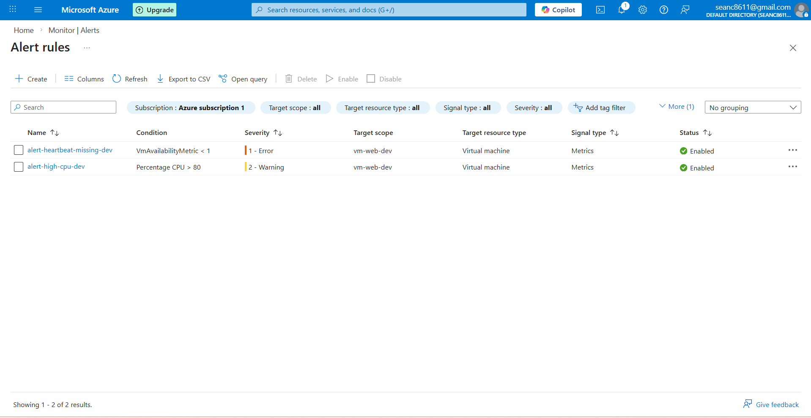
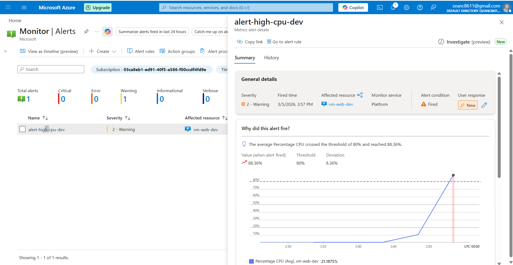
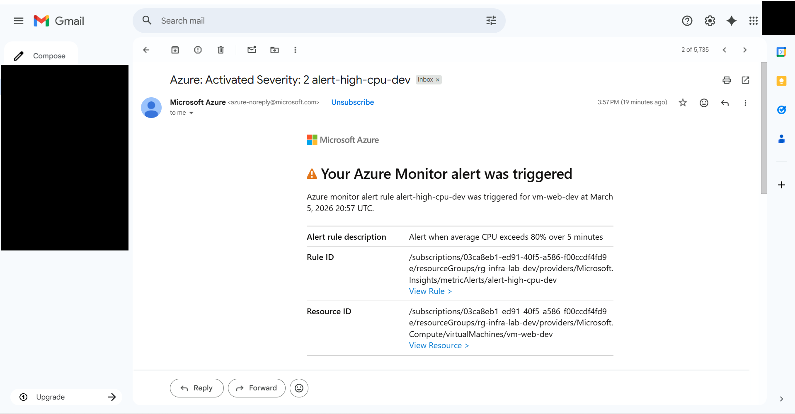

# Azure Infrastructure & Observability Lab

Terraform-managed Azure environment with CI/CD (GitHub Actions + OIDC), monitoring (Azure Monitor Agent + Log Analytics), alerting, and operational documentation.

Built to demonstrate the end-to-end workflow a cloud/DevOps engineer uses to provision, monitor, and operate infrastructure as code — from `terraform plan` on a pull request to a fired alert landing in your inbox.

---

## Architecture



---

## What This Project Demonstrates

- **Infrastructure as Code:** VNet, subnets, NSGs, Linux VM, and all monitoring resources defined in Terraform with remote state in Azure Blob Storage.
- **CI/CD with OIDC:** GitHub Actions authenticates to Azure using federated credentials (OpenID Connect) — no client secrets stored anywhere. PRs run `fmt`, `validate`, and `plan`; merges to `main` run `apply` with environment protection.
- **Observability:** Azure Monitor Agent (AMA) collects syslog and performance counters via a Data Collection Rule, forwarding to a Log Analytics workspace. KQL queries surface operational signals like failed SSH attempts, CPU trends, and disk usage.
- **Alerting:** Platform metric alerts on the VM (CPU > 80%, heartbeat missing) trigger email notifications through an Action Group.

---

## Technologies

Terraform, Azure CLI, GitHub Actions, Azure VNet / NSG, Azure Linux VM, Azure Monitor Agent (AMA), Log Analytics, Data Collection Rules, KQL, Azure Monitor Metric Alerts, OIDC Workload Identity Federation

---

## Repo Structure

```
├── bootstrap/              # One-time Terraform for remote state backend
│   ├── main.tf
│   ├── variables.tf
│   └── outputs.tf
├── infra/                  # Main Terraform configuration
│   ├── providers.tf        # AzureRM provider + remote backend
│   ├── variables.tf
│   ├── main.tf             # Resource group
│   ├── network.tf          # VNet, subnets, NSGs
│   ├── compute.tf          # Linux VM, public IP, auto-shutdown
│   ├── monitoring.tf       # Log Analytics, AMA, DCR
│   ├── alerts.tf           # Metric alerts + action group
│   ├── outputs.tf
│   └── cloud-init.yaml     # nginx + stress-ng bootstrap
├── kql/                    # Saved KQL queries for operational investigation
│   ├── failed-ssh.kql
│   ├── top-cpu.kql
│   ├── disk-usage.kql
│   ├── heartbeat-check.kql
│   └── syslog-errors.kql
├── .github/workflows/
│   ├── terraform-plan.yml  # Runs on PRs: fmt, validate, plan
│   └── terraform-apply.yml # Runs on push to main: apply (production env)
└── docs/
    ├── diagrams/architecture.png
    ├── runbook-cpu-alert-investigation.md
    └── screenshots/
```

---

## CI/CD Pipeline (OIDC)

GitHub Actions authenticates to Azure using **workload identity federation (OIDC)** instead of storing client secrets. This is the current best practice for CI/CD-to-cloud authentication:

1. An Azure AD App Registration has federated credentials trusting GitHub's OIDC token issuer.
2. On **pull requests**, the plan workflow requests a short-lived token, runs `terraform fmt -check`, `validate`, and `plan`, then posts a summary comment on the PR.
3. On **push to main**, the apply workflow requests a token scoped to the `production` GitHub environment and runs `terraform apply`.

No `ARM_CLIENT_SECRET` exists anywhere — not in GitHub Secrets, not in code, not in environment variables.

### Terraform Apply (push to main)



### Terraform Plan (pull request)



### PR Checks Passed



---

## Monitoring & Observability

The Azure Monitor Agent (AMA) is installed on the VM via Terraform and collects data through a Data Collection Rule (DCR):

- **Syslog:** auth, authpriv, cron, daemon, kern, syslog, user (Info level and above)
- **Performance counters:** CPU, memory, disk free space, disk free megabytes, network bytes in/out (sampled every 60s)

Data flows into a Log Analytics workspace (`law-infra-lab-dev`) with 30-day retention.

### Heartbeat Ingesting (Log Analytics)



### KQL Queries

The `kql/` folder contains saved queries for common operational investigation scenarios:

| Query | Purpose |
|---|---|
| `failed-ssh.kql` | Surfaces brute-force attempts and unauthorized SSH access from syslog |
| `top-cpu.kql` | Tracks CPU utilization trends for capacity planning and alert correlation |
| `disk-usage.kql` | Identifies volumes approaching capacity (< 20% free) |
| `heartbeat-check.kql` | Lists VMs and their last heartbeat to detect unresponsive agents |
| `syslog-errors.kql` | Aggregates error-level syslog messages by facility |

### KQL CPU Spike (during alert validation)



---

## Alerting

Two platform metric alerts are defined in Terraform (`infra/alerts.tf`), scoped directly to the VM:

| Alert | Metric | Condition | Severity |
|---|---|---|---|
| High CPU | `Percentage CPU` | Average > 80% over 5 min | 2 (Warning) |
| Heartbeat Missing | `VmAvailabilityMetric` | Average < 1 over 5 min | 1 (Error) |

Both route to an Action Group that sends email notifications.

### Alert Rules (Azure Monitor)



### High CPU Alert Fired

To validate the alerting pipeline, `stress-ng --cpu 1 --timeout 360s` was run on the VM. The CPU alert fired within 5 minutes:



### Alert Email Notification



---

## Runbook

An operational runbook for investigating the high CPU alert is included at [`docs/runbook-cpu-alert-investigation.md`](docs/runbook-cpu-alert-investigation.md). It covers:

1. Triage checklist (confirm alert, check if expected, verify VM reachable)
2. KQL investigation (CPU trend query, correlated syslog errors)
3. Process identification on the VM (`top`, `ps aux`)
4. Remediation table (common root causes and actions)
5. Alert auto-resolution verification
6. Documentation and closure

---

## Cost Controls

This lab was built on an Azure Free Account ($200 credit / 30 days). Costs are minimized by:

- **Auto-shutdown** on the VM at 11:00 PM EST daily (defined in `compute.tf`)
- **Log Analytics** uses the free 5 GB/month ingestion tier
- **Remote state** storage account costs fractions of a penny
- All resources can be destroyed with `terraform destroy` when not in use

---

## Teardown

```bash
# Destroy the main infrastructure
cd infra
terraform destroy -var-file="terraform.tfvars"

# Destroy the state backend (do this last)
cd ../bootstrap
terraform destroy -var="subscription_id=<YOUR_SUB_ID>" -var="storage_account_name=<YOUR_SA_NAME>"

# Clean up the Azure AD app registration
az ad app delete --id <APP_CLIENT_ID>
```

---

## Run Locally

From `infra/`, with Azure CLI authenticated (`az login`):

```bash
terraform init
terraform plan -var-file="terraform.tfvars"
terraform apply -var-file="terraform.tfvars"
```

Requires a `terraform.tfvars` file (not committed) with: `subscription_id`, `admin_ssh_public_key`, `allowed_ssh_ip`, and `alert_email`.